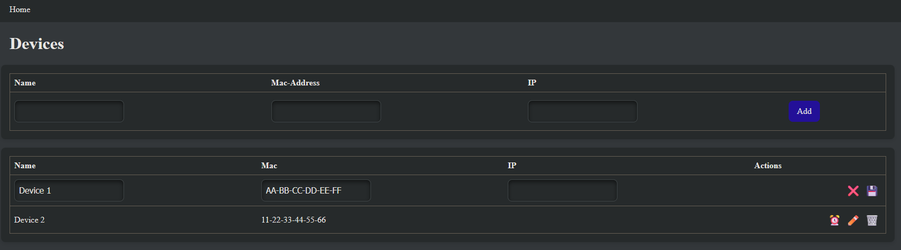

# WoL GUI

## Screenshots



## Features

Currently, wol-gui has the following features:

- Add new devices
- Edit existing devices
- Send magic packets

I'd love to add an online monitor (hence the IP field), but I'm unsure when I'll get to it.

## Installation

wol-gui can be installed using docker:

```shell
docker pull ghcr.io/rahn-it/wol-gui:master
docker run -d --network=host --name wol-gui -e PORT=8080 -v ./db:/app/db ghcr.io/rahn-it/wol-gui:master
```

I would recommend using docker-compose though.

As a starting point you can use the [docker compose file](docker-compose.yaml) from this repository.

## Usage

You can access the GUI at port 8080 or the one you specified while launching. e.g.: http://localhost:8000

If you have any questions or problems, you're welcome to create an issue :)

# Attribution

This project is licensed under the [AGPL-3.0](LICENSE).

Developed by [Rahn IT](https://it-rahn.de/).
